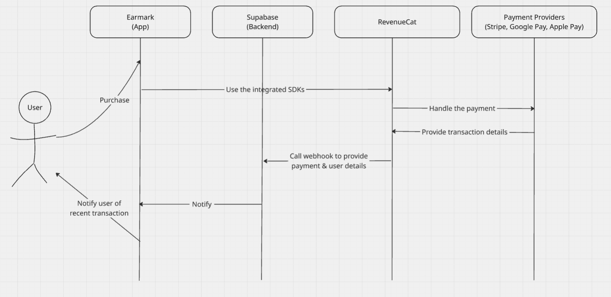
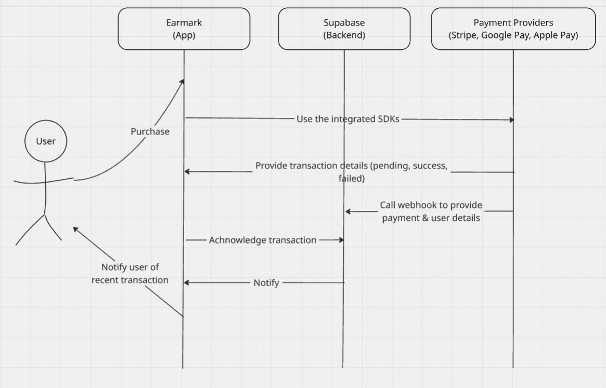

# Subscription Design Guide

Hi there. In this guide, I’ll walk you through how I would design an annual and monthly subscription system for a product that needs to support in-app payments using Stripe, Google Play, and Apple Pay. I’ll also introduce RevenueCat as an option to simplify everything if you're aiming for a smoother dev experience.

---

## How I Picture the User Journey

Let’s start by visualizing the journey our users will take:

```
User Registration → Subscription Selection → Choose Payment Method
→ Make Payment → Activate Subscription → Grant Access → Manage Lifecycle
```

Each step connects closely with a technical component we’ll be designing for.

---

## My High-Level Payment Flow

Here’s the general idea of what happens:

1. The user picks a plan (e.g. annually or monthly).
2. They choose a payment method: Stripe (card), Google Play (Android), or Apple Pay (iOS).
3. The payment is processed using the provider’s SDK or interface.
4. Once the payment goes through, we activate the subscription and update the status in the backend.
5. Access to features is now granted to the end user.
6. Behind the scenes, we manage renewals, failed payments, and cancellations.

I’ve drawn out two different flows — one using RevenueCat (more streamlined), and one that integrates with the payment providers directly (hard to maintain but with more control).

---

## The Payment Providers

### 1. Stripe

If I’m going for web or cross-platform, Stripe.

- I’d use the Payment Intents API to handle payment steps securely.
- It supports cards globally.
- It has great SDKs, and it’s PCI-compliant.

### 2. Google Play (Android)

For Android devices, Google Play Billing Library.

- Google manages renewals and cancellations.
- I get automatic subscription status via the Play Console or server-to-server notifications.

### 3. Apple Pay (iOS)

For iOS, Apple’s StoreKit.

- Apple manages the entire lifecycle.
- I can listen to subscription changes with App Store Server Notifications.

---

## How to Store Subscription Data

Should keep everything inside Supabase (PostgreSQL). Here’s what to track:

- Earmark's `public.user_id` to not directly expose the sensitive `auth.user_id`
- `subscription_id` from the payment provider
- `provider` (stripe, apple, google)
- `status` (active, cancelled, past_due)
- `renewal_date`, `expiration_date`

---

## Controlling Access Based on Subscriptions

For access control, here’s how to do it:

- Every time a user logs in, or accesses a protected page, I’d check their subscription status.
- This can be done via middleware, backend API validation, or a Supabase Row-Level Security policy.
- I’d also run a cron job daily to flag users whose subscriptions expired but weren’t caught in real-time.

---

## What Happens During Lifecycle Events?

### ✅ If Payment Succeeds:
- I mark the user’s subscription as active.
- Store the next renewal date.
- Let them know it worked.

### ❌ If Payment Fails:
- I move their status to `past_due`.
- Notify them with retry options.

### 🛑 If They Cancel:
- I mark it as cancelled but keep access until the end of the billing period.
- Remind them when access is about to expire.

### 🔁 If It Renews Automatically:
- The backend picks up the update via webhook or polling.
- I confirm everything is still active.

---

## Option A: RevenueCat (Simpler, less headache)

If I want to move faster and avoid handling platform-specific logic, RevenueCat is a life-saver.

### What I Like About It:
- Unified SDK for Stripe, Google, Apple.
- Great dashboard and analytics.
- It handles all the edge cases for me.
- I just listen to webhooks and use their API to check user entitlements.

### Integration Flow:
1. Integrate RevenueCat SDK into the app.
2. Set up subscriptions in their dashboard.
3. RevenueCat talks to Apple, Google, or Stripe.
4. I listen for webhook events in Supabase and update my DB.



---

## Option B: Direct Integration (If You Want Full Control)

If the requirements need tighter control or don’t want a dependency, Go straight to Stripe, Apple, and Google.

### Here's how:
1. Use their official SDKs in my mobile/web apps.
2. Send payment confirmation to Supabase.
3. Set up webhooks from Stripe/Apple/Google to inform Supabase of events.
4. Supabase stores and updates subscription status accordingly.


